# 🛰️ Orbital-SVD: Low-Rank

 **Matrix Approximation for Satellite Telemetry**
Version: 1.0.0-Beta
Classification: Open Research / Independent Research 
License: Apache License 2.0
Author: Lawrence K. Hawthrone

## 1. Introduction & Concept
The Orbital-SVD Processor is a specialized tool designed for Ground Station data processing. It focuses on the compression and noise mitigation of orbital imagery. This software is a refactored implementation aimed at being CCSDS-compliant (Consultative Committee for Space Data Systems), providing a robust pipeline for handling high-resolution satellite data that must be optimized for terrestrial storage and quick transmission.

## 2. Software Parameters & Usage
Dependencies
 * Python 3.10+
 * NumPy: Linear algebra backend for SVD operations.
 * Pillow (PIL): Image I/O and Gaussian filtering.
 * Tkinter: Xubuntu-optimized GUI.
How to Deploy
 * Ensure all tactical modules (main_gui.py, logic_svd.py, results_viewer.py) are in the same sector.
 * Configure mission constraints in config_mission.xml.
 * Execute python main_gui.py.
 * Select the target orbital image and verify the reconstruction in the Results Viewer.

## 3. Mission Backstory: The "Lattes" Incident
The development of this algorithm wasn't born in a sterile lab, but from necessity. During a critical deployment of data to the Lattes Platform (a Brazilian researcher database), a hard constraint was encountered: a 70KB limit for profile imagery. With a 150KB source file saturated with high-frequency background noise, standard methods failed. This tool was developed to "finesse" the data into compliance.

## 4. Encountered Challenges (The Tactical Bottlenecks)
 * High-Frequency Noise: Background structures acting as digital noise, consuming precious bits in the compression header.
 * RGB Complexity: Multi-channel SVD processing increased overhead without adding relevant scientific data for this specific mission.
 * Information Decay: Preventing "blocky" artifacts to maintain maintenance of forms.

## 5. Solutions & Trade-offs
The Gaussian Low-Pass Filter
To neutralize noise, we implemented a Gaussian Blur as pre-processing.
> Why? Gaussian Blur acts as a Low-Pass Filter. In the frequency domain, it attenuates high frequencies (noise/sharp edges) while preserving low frequencies (main forms), making the SVD much more efficient.
> 
Single-Channel Monochromatic Strategy
Transitioned from RGB to L-mode (Luminance).
 * Trade-off: Loss of color data.
 * Benefit: Dramatic increase in signal-to-noise ratio. Plus, Black and White provides a much more professional and focused aesthetic for research profiles.
JPEG & Huffman Encoding
The final stage utilizes the JPEG algorithm. By combining SVD (linear algebra reduction) with Huffman encoding (entropy), we achieve superior hybrid compression.

#  Experimental Results & Benchmarking
Visual Comparison (Example: Carajás Mine, source: https://science.nasa.gov/earth/earth-observatory/brazils-carajas-mines-144457/)

| Original (108 KB) | SVD Output (20 KB) |
| :---: | :---: |
| 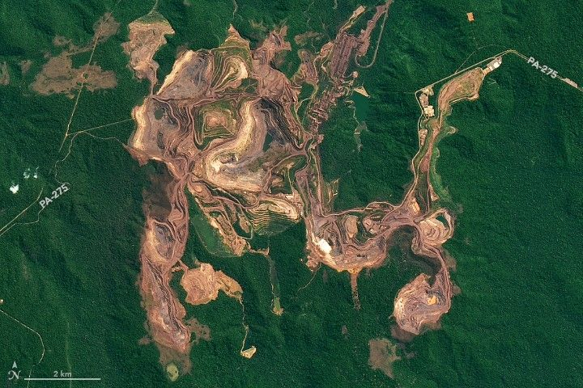 | 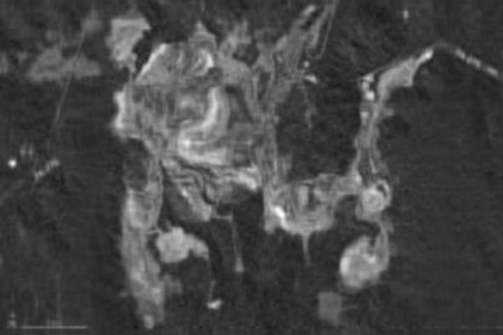 |

#3 Technical Data
**Parameters: k=0.08, Quality=65, Blur=1.5.**

***Disclaimer: All images source comes from the NASA's Earth laboratory, all rights reserved from NASA (Thanks NASA!)***

| Mission Target | Original Size | SVD Output | Reduction | Source Link |
|---|---|---|---|---|
| Carajás Mine (Brazil) | 108 KB | 20 KB | 81.4% | NASA EO |
| Blue Marble | 523 KB | 220 KB | 57.9% | NASA EO |
| Europe At Night | 67 KB | 17 KB | 74.6% | NASA EO |
| Phytoplankton Swirl | 28 KB | 7.5 KB | 73.2% | NASA EO |
| Lake Eyre | 99 KB | 26 KB | 73.7% | NASA EO | 
| Orion Earth View | 40 KB | 16 KB | 60.0% | NASA EO |
| Madagascar Cyclone | 152 KB | 44 KB | 71.0% | NASA EO |
| Old West Dust | 108 KB | 26 KB | 75.9% | NASA EO |

## See another images

### A. [Blue Marble](https://science.nasa.gov/earth/earth-observatory/the-blue-marble-true-color-global-imagery-at-1km-resolution/)
| Original | SVD Output |
| :---: | :---: |
| 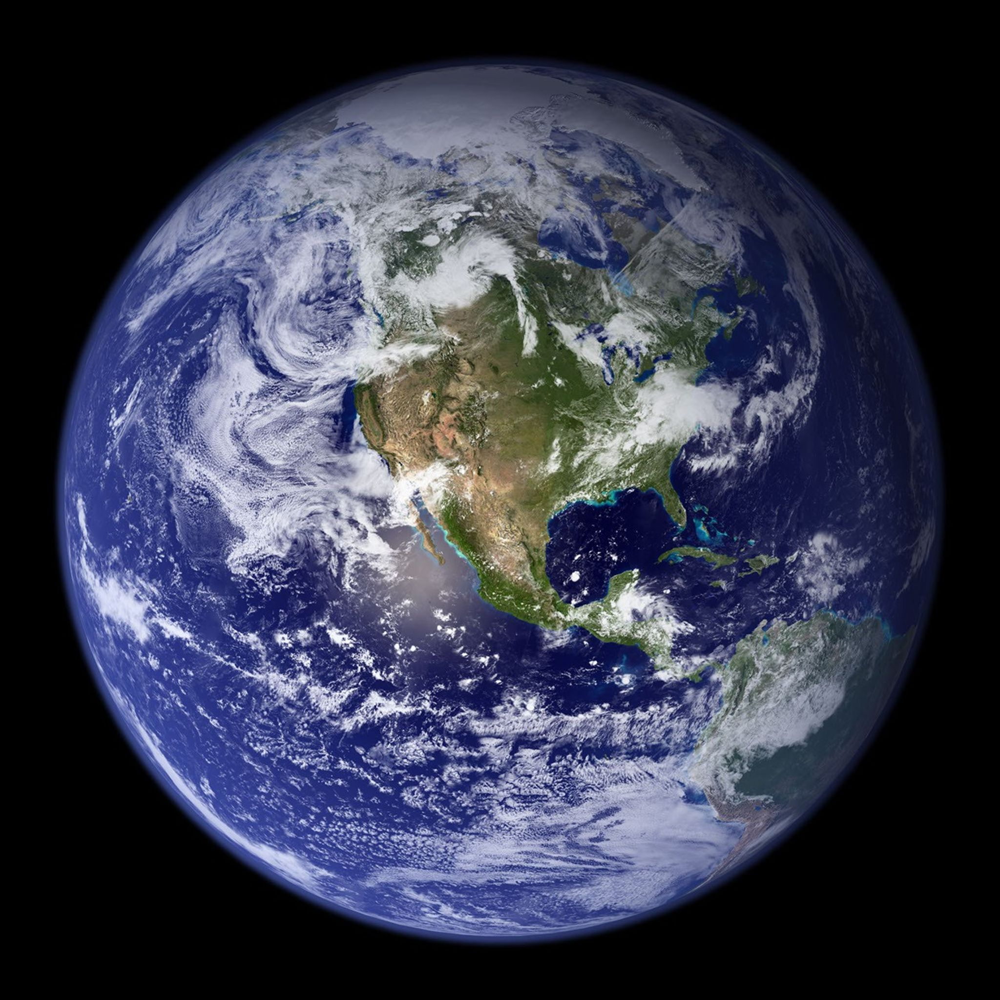 | 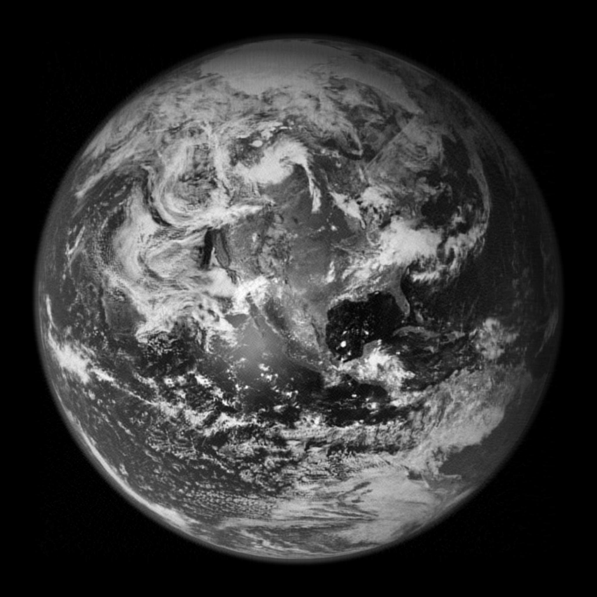 |

### B. [Orion Views Earth from Afar](https://science.nasa.gov/earth/earth-observatory/orion-views-earth-from-afar-150699/)
| Original | SVD Output |
| :---: | :---: |
| 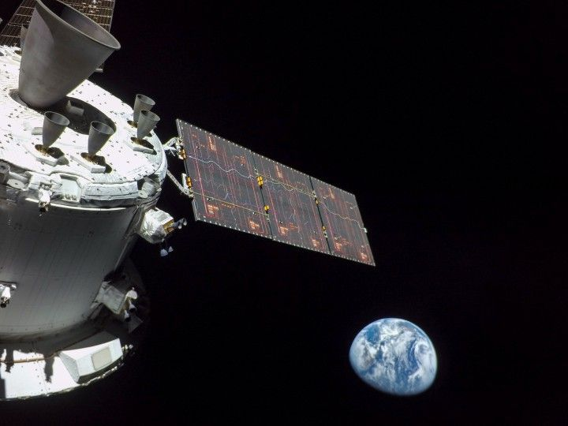 | 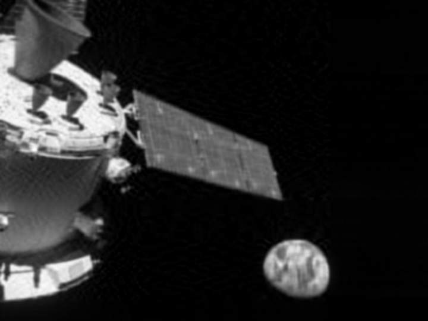 |

### C. [Europe At Night](https://science.nasa.gov/earth/earth-observatory/europe-at-night-152693/)
| Original | SVD Output |
| :---: | :---: |
| 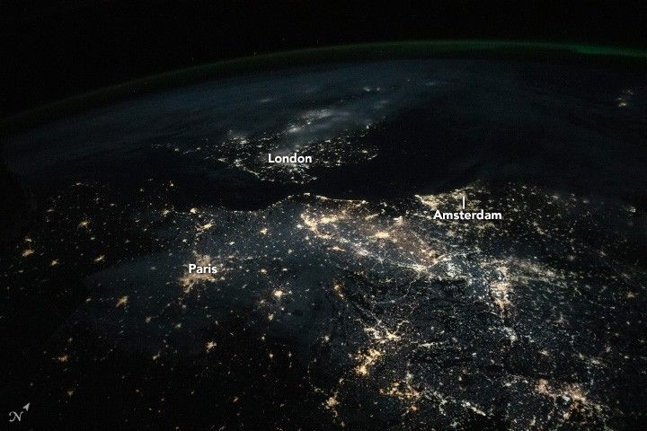 | 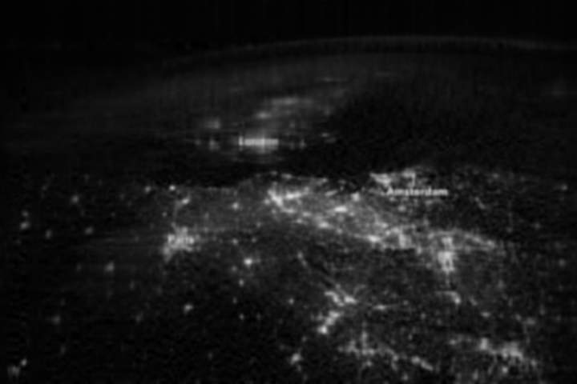 |

### D. [Lake Eyre Blushes](https://science.nasa.gov/earth/earth-observatory/lake-eyre-blushes/)
| Original | SVD Output |
| :---: | :---: |
| 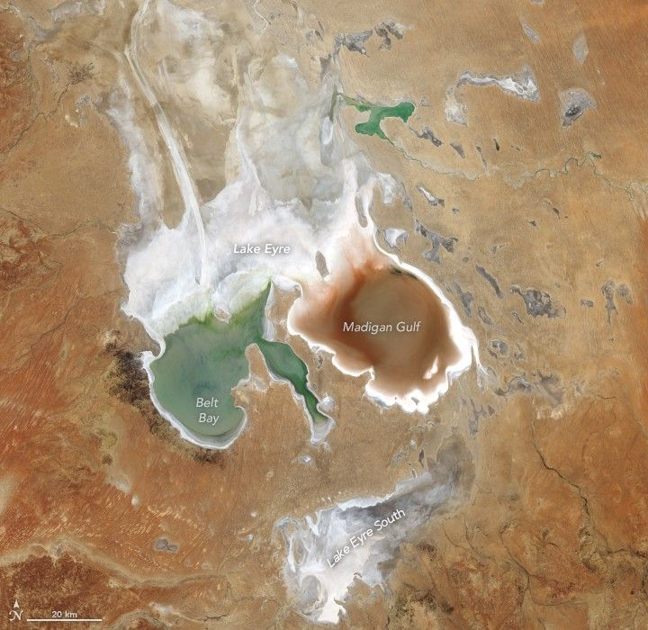 | 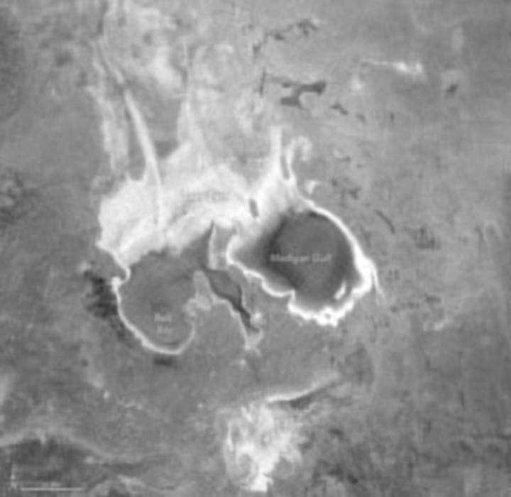 |

### E. [Second Cyclone Slams Madagascar](https://science.nasa.gov/earth/earth-observatory/a-second-cyclone-slams-madagascar/)
| Original | SVD Output |
| :---: | :---: |
| 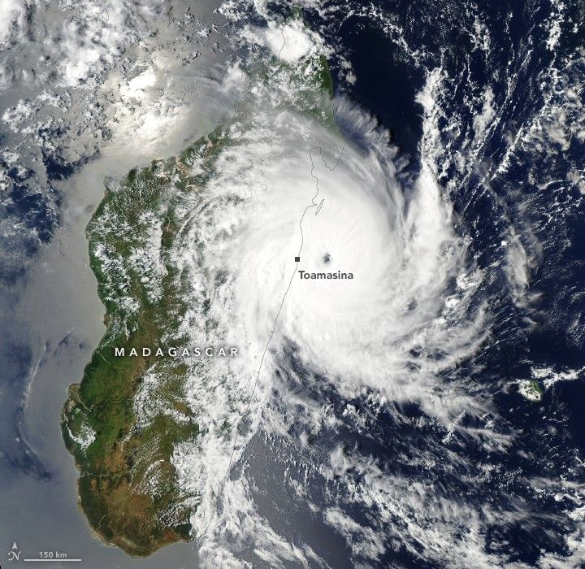 | 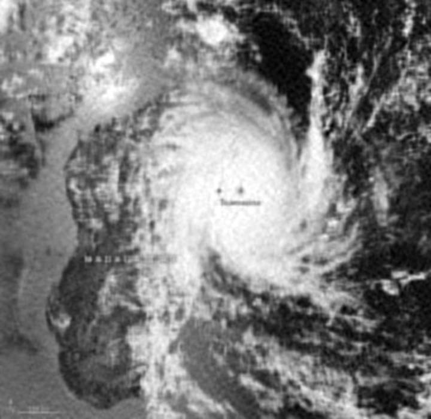 |

### F. [A Dust Vetige of the Old West](https://science.nasa.gov/earth/earth-observatory/a-dusty-vestige-of-the-old-west-154481/)
| Original | SVD Output |
| :---: | :---: |
| 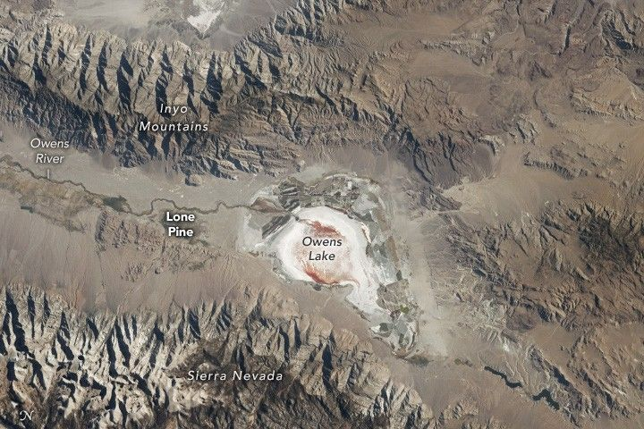 | 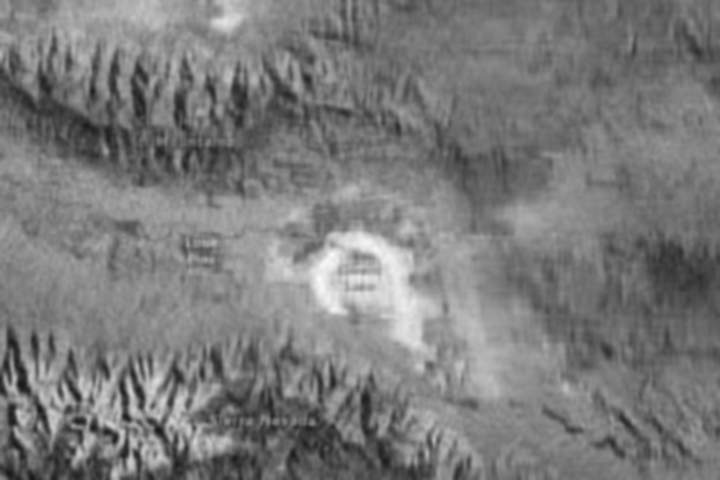 |

### G. [A Swirl of a Day for phytoplankton](https://science.nasa.gov/earth/earth-observatory/a-swirl-of-a-day-for-phytoplankton-154086/)
| Original | SVD Output |
| :---: | :---: |
| 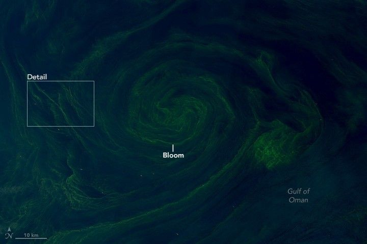 | 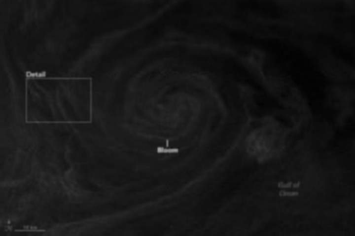 |

**You can also search the imagery (original and results) on the /samples folder**

## Mission Summary
The hybrid Gaussian Blur-SVD Single-Channel-JPEG pipeline achieved an average compression rate of ~71%. Significant gains were observed in images with high-frequency noise, where the Gaussian filter prepared the matrix for a more efficient SVD. In real missions we can also adjusts the parameters to choose between eficiency or quality, but also search a balance between these parameters.

## 8. Final Considerations
This implementation demonstrates that data constraints are catalysts for better engineering. By decoupling signal from noise, we transmit essential orbital information without compromising scientific value and operating even in scenarios with low bandwidth.

***"Science Is Elegant!"***